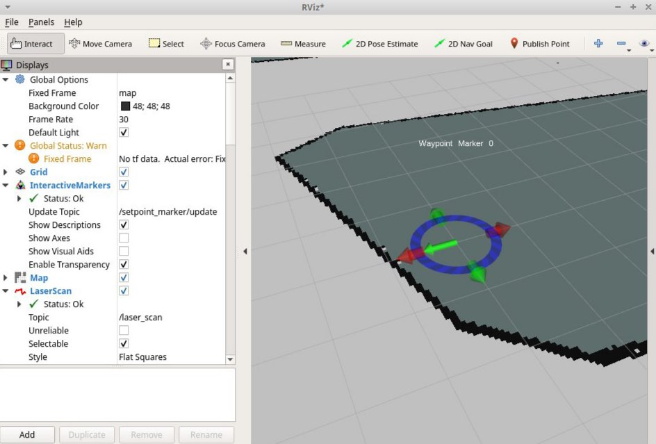
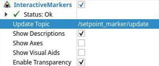

# waypointgen
A waypoint generator (using InteractiveMarkers in Rviz) and a waypoint server for playback. 

## Usage
Ensure that the waypointgen action msg is cloned into the workspace before cloning the main waypointgen package:
```
$ git clone https://github.com/1487quantum/wpg_msg.git
```

Git clone the ROS Package into the relevant workspace & compile it:
```
$ git clone https://github.com/1487quantum/waypointgen.git
$ catkin_make
```

### Setpoint Markers


Launch the Waypoint Generator via *roslaunch*, which would launch the program and rviz:
```
$ roslaunch waypointgen setpoint_marker.launch  
```
Next, add the InteractiveMarker in Rviz. (Topic name: */setpoint_marker/update*)



There are 3 options to choose from the context menu (when the marker is _right-clicked_), which are
- **Get Location**: Get current location of marker selected.
- **Waypoint**
  - **Add**: Add new waypoint.
  - **Remove**: Remove selected waypoint.
- **Generate Waypoint List**: Generate waypoint list to be used in waypoint playback.


### Waypoint playback
Launch the playback server via *roslaunch*:
```
$ roslaunch waypointgen setpoint_server.launch  
```
The path of the waypoint list is specified via the *pathway* param in the launch file.
```
<param name="pathway" type="str" value="a.yaml"/>
```
The server would send out the waypoint goals from the list specified in the launch file 10s after initialisation.
